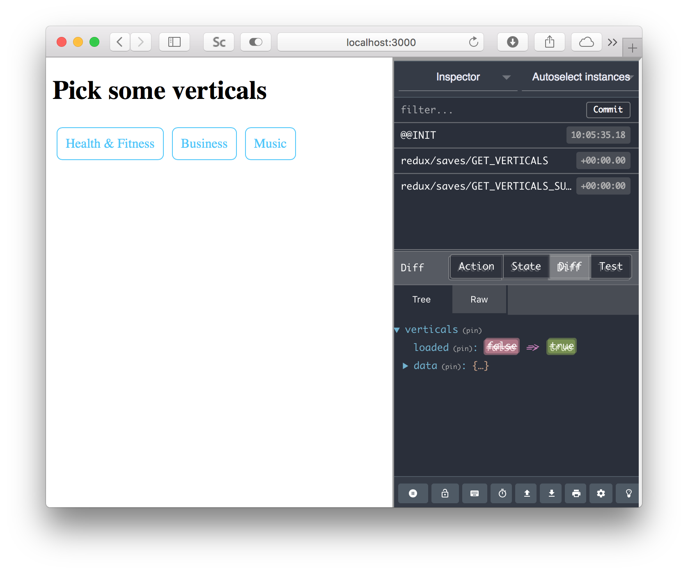

# Safari Redux DevTools Extension

> **It's under major development**, so please check back soon or make a pull request.



We've long wanted a Redux Devtools extension for the world's fastest browser!

As of now, this one simply uses an `iframe` to show [remote-redux-devtools](https://github.com/zalmoxisus/remote-redux-devtools).

That means you'll need to set up your redux store something like this:

```js
const store = createStore(reducer, preloadedState, devToolsEnhancer());
```

Don't worry, it's very flexible and more examples are [in the readme](https://github.com/zalmoxisus/remote-redux-devtools).

It's limited to `localhost` domains for now as well.
